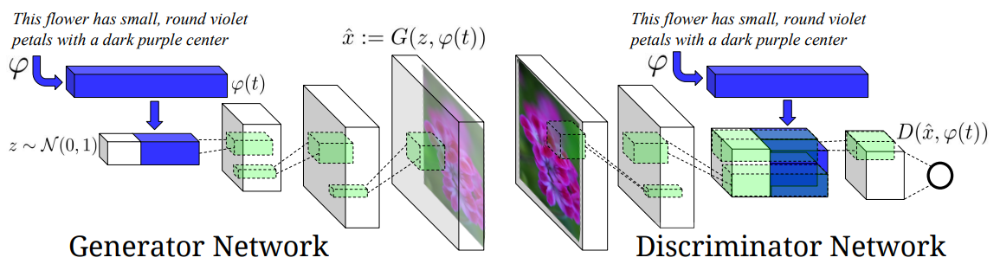
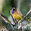

# Generative-Adversarial-Text-to-Image-Synthesis-Pytorch
Generative Adversarial Text-to-Image Synthesis ICML 2016 Implementation
</img>

## Example Results
|Input Text|Result|
|---|---|
|this bird has wings that are black and has a white belly.|</img>|
|this is a large white bird with a black head and a pointy orange bill.|</img>|
|the bird has a yellow breast and belly and a black bill.|</img>|
|a small bird with a black pointed beak, red nape with black crow, white colored breast.|</img>|
|this bird is medium sized with a black sharp beak and blue highlights.|</img>|


## Usage
### Prerequisites
- Python 3.7
- Pytorch 1.7.1
- TorchVision 0.8.2
- Pillow
- Visdom
- h5py

### Getting Started
#### Installation
Clone this repo:
```bash
git clone https://github.com/SuhyeonHa/Generative-Adversarial-Text-to-Image-Synthesis-Pytorch
cd Generative-Adversarial-Text-to-Image-Synthesis-Pytorch
```
#### Dataset
- [Caltech-UCSD Birds 200](http://www.vision.caltech.edu/visipedia/CUB-200-2011.html)
I used hdf5 a file of [aelnouby](https://github.com/aelnouby/Text-to-Image-Synthesis) which contains images, imbeddings, and texts.

#### Model Training
```bash
train.py --dataset_path D:\PycharmProjects\Generative-Adversarial-Text-to-Image-Synthesis-Pytorch/birds.hdf5
```
#### Use a Pre-trained Model
- Download a Pre-trained generator [here](https://drive.google.com/file/d/1txG-cUDC0cE48cward2DOlmvRP_wlXpG/view?usp=sharing)
```bash
test.py --isTraining False --model_dir D:\PycharmProjects\Generative-Adversarial-Text-to-Image-Synthesis-Pytorch\checkpoints/
```

